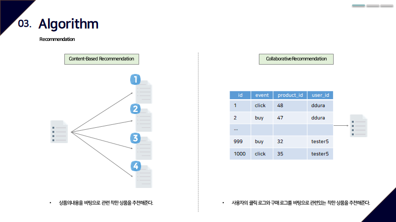
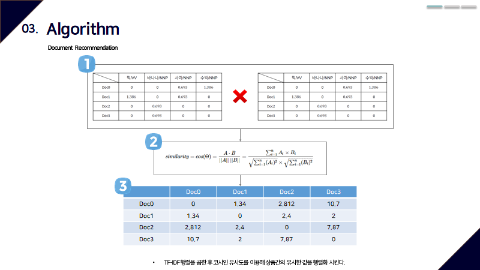

# Angelhackseoul2020-TeamING-HelloWorldApp-Backend

## 추천 알고리즘 구현
- Contents Based Filtering 에서는 각각의 사용자와 아이템에 대하여 프로필을 작성하고, 이를 기반으로 추천.
- Collaborative Filtering에서는 프로필 데이터 없이, 사용자의 과거 행동 데이터만 가지고 추천.

- Contents Based Filtering 구현 설명
  - 상품 데이터의 제목, 카테고리, 가격, Tag 데이터를 스페이스 기준으로 직렬화 시킨다.  
  - Scikit learn의 CountVectorzier 사용해 token화 시킨다.  
  - 위의 token 데이터를 cosine similarity를 사용해 matrix를 만든다.   
  - 특정 상품과 유사한 상품을 추천한다.?   

- Collaborative Filtering 구현 설명
  - 클릭은 가중치 1, 구매는 가중치 5를 설정해 유저당 상품 구매 목륵의 .  
  - Scikit learn의 CountVectorzier 사용해 token화 시킨다.  
  - 위의 token 데이터를 cosine similarity를 사용해 matrix를 만든다.  
  - 특정 삼품과 관련된 상품을 추천한다.  
